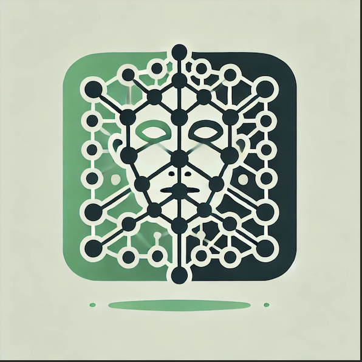

# A3DS
Adversarial Detection System

A3DS is an early stage project designed to be robust and scalable providing detection technologies for adversarial activity. 

### Technology

1. Clustering Algorithms
2. High performance network scanners
3. Knowledge Graphs using MITRE Atlas Framework (ATTAcK can be integrated)
4. Multi-agent "swarms" experiment - capabilities that scale with the threat load.
5. Distributed Network of Nodes
6. Large Language Model for standardisation
7. Integration with common OSS
8. Communications with multiple platforms

### Stack

1. Python
2. SkLearn
3. Rust for data transmission and distribution

### Contact
**core@defensiveai.com**
